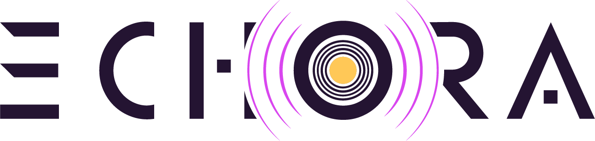
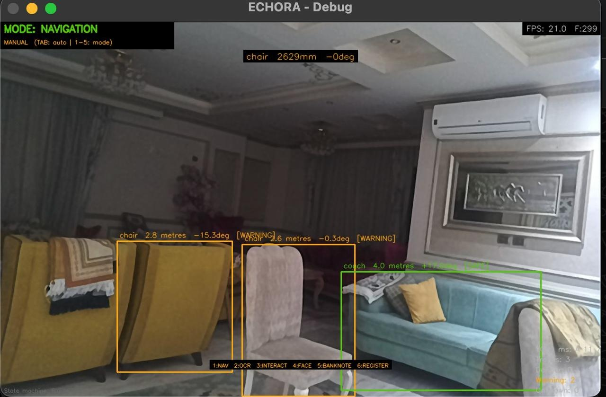
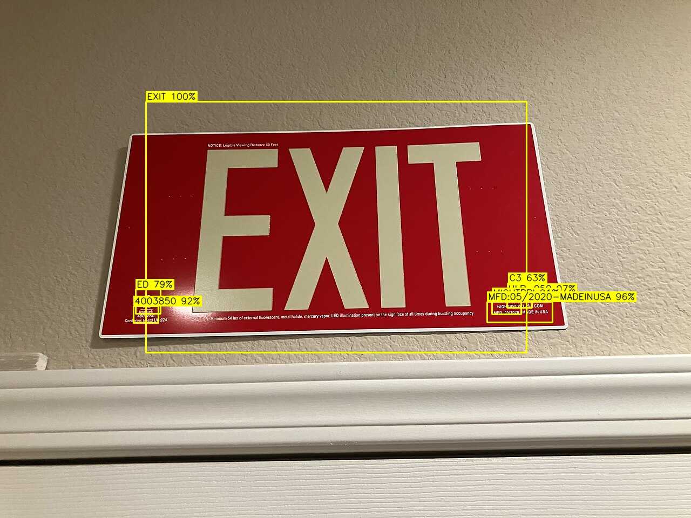
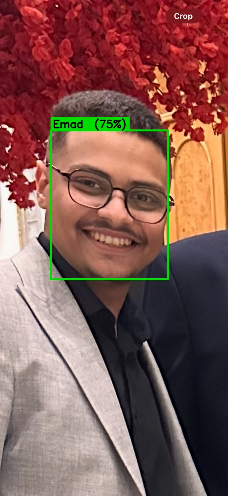
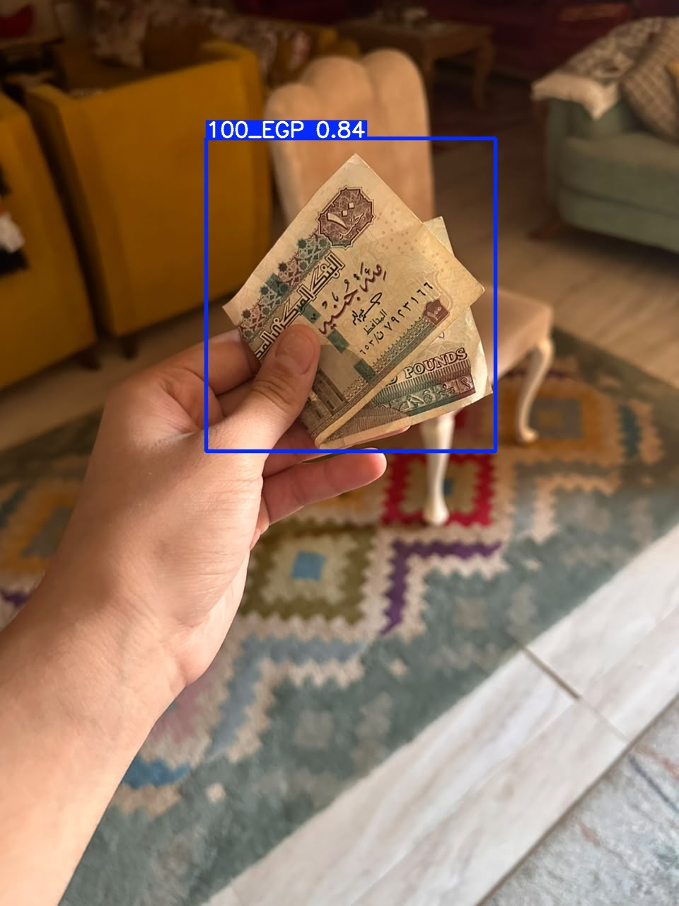
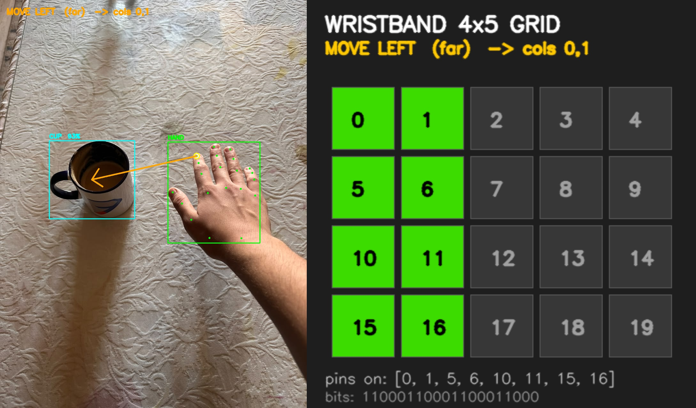
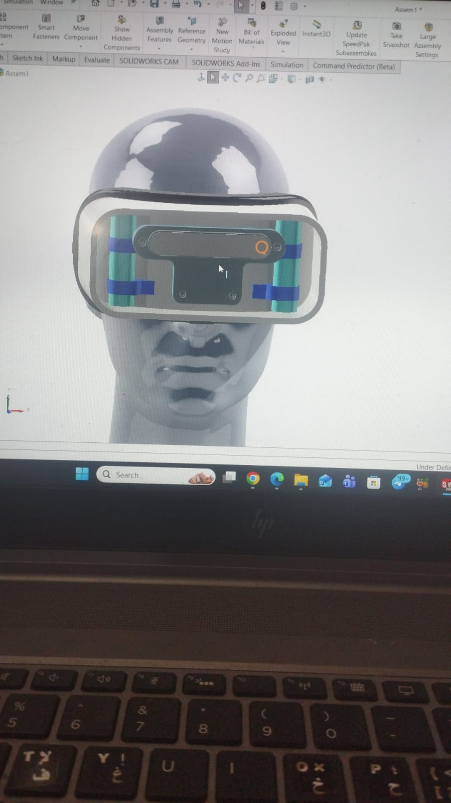
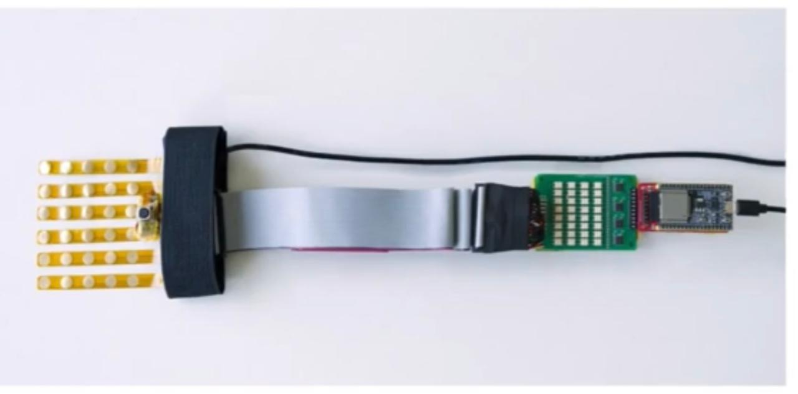
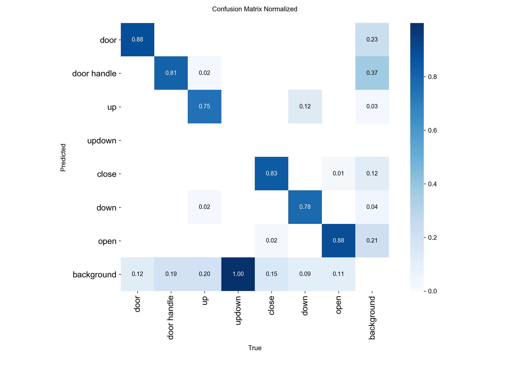
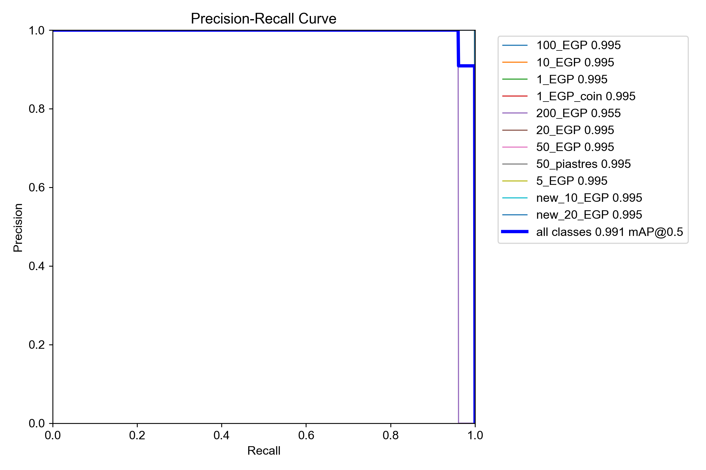

<div align="center">



# ECHORA

### AI-Powered Sensory Substitution System for the Blind and Low-Vision

*Real-time environmental awareness through audio and haptic feedback.*

[](https://www.python.org/)
[](https://github.com/ultralytics/ultralytics)
[](https://github.com/PaddlePaddle/PaddleOCR)
[](https://github.com/deepinsight/insightface)
[](https://docs.luxonis.com/)
[](LICENSE)

</div>

---

## Overview

Blind and Low-Vision (BLV) individuals face persistent challenges in recognizing visual
information and interacting with physical objects. Existing assistive tools mostly solve
*isolated* tasks — reading text **or** identifying an object — and lack an integrated,
real-time interaction framework.

**ECHORA** is an AI-powered sensory-substitution system that unifies recognition,
interaction, and perception in a single adaptive framework. It pairs a wearable
**depth camera + haptic wristband** with **PC-based AI inference** to translate visual
and semantic information into intuitive **audio (TTS)** and **tactile (haptic)** cues.

All high-level processing runs **locally** — ensuring low latency, privacy, and full
independence from cloud connectivity.

> 🎓 Graduation Project — Arab Academy for Science, Technology & Maritime Transport (AAST).

---

## 🎬 Demo

| Promo | Full Demo |
|:-----:|:---------:|
| [](https://github.com/YoussefAbdelrahman8/echora/releases/latest) | [](https://github.com/YoussefAbdelrahman8/echora/releases/latest) |

▶️ **Videos are hosted on the [latest GitHub Release](https://github.com/YoussefAbdelrahman8/echora/releases/latest)** (`Echora-Promo.mp4` and `Echora.mp4`).

---

## ✨ Key Features

ECHORA runs five perception modes, orchestrated by an adaptive state machine that
switches automatically based on context (and falls back to navigation on any danger):

| Mode | What it does | Engine |
|------|--------------|--------|
| 🧭 **Navigation** | Detects obstacles, classifies distance zones (danger / warning / safe), tracks approach speed, and routes spatial audio + haptic alerts. | YOLOv8 + ByteTrack + OAK-D depth |
| 📖 **OCR** | Reads text from signs, labels, and documents aloud (English). | PaddleOCR PP-OCRv4 |
| 👤 **Face ID** | Recognizes enrolled people via face embeddings. | InsightFace (RetinaFace + ArcFace) |
| 💵 **Banknote** | Identifies Egyptian Pound (EGP) banknote denominations. | YOLOv8 (custom-trained) |
| ✋ **Interaction** | Guides the user's hand toward a target object with directional haptic cues. | MediaPipe Hands + haptic grid |

---

## 📸 Screenshots

<div align="center">

| Navigation (obstacle zones) | OCR (text reading) | Face ID |
|:---:|:---:|:---:|
|  |  |  |

| Banknote (EGP) | Hand interaction | |
|:---:|:---:|:---:|
|  |  | |

</div>

---

## 🦾 Hardware

ECHORA is worn as a pair of **camera glasses** (OAK-D depth camera) plus a wrist-worn
**ESP32 haptic wristband**. The glasses sense; the PC reasons; audio and haptics inform.

<div align="center">

| Camera Glasses | Haptic Wristband |
|:---:|:---:|
|  |  |

</div>

- **Sensing:** Luxonis **OAK-D** — synchronized RGB + spatial depth + IMU.
- **Feedback:** **ESP32** BLE/WiFi wristband (vibration motors) + bone-conduction / earphone audio.
- **Compute:** All AI inference runs on a connected PC (no cloud).

---

## 🏗️ Architecture

ECHORA operates in a continuous frame loop driven by `control_unit.py`:

```
        ┌──────────────┐     RGB + Depth + IMU      ┌─────────────────────┐
        │  OAK-D Camera │ ─────────────────────────▶ │   control_unit.py   │
        │  (hardware)   │                            │  (30 FPS game-loop) │
        └──────────────┘                            └──────────┬──────────┘
                                                               │ routes by active mode
                              ┌────────────────────────────────┼────────────────────────────────┐
                              ▼                ▼                ▼                ▼                ▼
                         Navigation          OCR            Face ID          Banknote       Interaction
                        (YOLO+ByteTrack)  (PaddleOCR)     (InsightFace)        (YOLO)      (MediaPipe Hands)
                              └────────────────────────────────┼────────────────────────────────┘
                                                               ▼
                                                       state_machine.py
                                                   (mode switching + safety)
                                                               ▼
                              ┌────────────────────────────────┴────────────────────┐
                              ▼                                                       ▼
                       audio_feedback.py                                      haptic_feedback.py
                    (TTS + spatial panning)                                (ESP32 vibration wristband)
```

1. **Capture** — `camera.py` acquires synchronized RGB frames and depth maps from the OAK-D.
2. **Route** — `control_unit.py` dispatches the frame bundle to the active perception engine.
   Obstacle detection runs every frame; faces / banknotes / interaction run at sub-frame tick
   rates to balance load.
3. **Decide** — `state_machine.py` switches modes on context (e.g. a readable sign at threshold
   → OCR mode), and force-switches to Navigation on any danger-zone obstacle.
4. **Output** — `audio_feedback.py` (threaded TTS with spatial panning) and `haptic_feedback.py`
   (BLE vibration intensity by proximity) inform the user.

---

## 📊 Model Performance

<div align="center">

| Navigation — confusion matrix | Banknote — precision/recall |
|:---:|:---:|
|  |  |

</div>

Full evaluation curves and validation batches are in [`assets/eval/`](assets/eval/).

---

## 🚀 Getting Started

### 1. Clone

```bash
git clone https://github.com/YoussefAbdelrahman8/echora.git
cd echora
```

### 2. Environment & dependencies

```bash
python -m venv .venv
source .venv/bin/activate          # Windows: .venv\Scripts\activate
pip install -r requirements.txt
```

> **GPU users:** install a matching `paddlepaddle-gpu` and CUDA-enabled `torch` *before*
> `pip install -r requirements.txt`. See the comments in `requirements.txt`.

### 3. Download the model weights

Model weights are **not** stored in git. Download `echora-models.zip` from the
[latest Release](https://github.com/YoussefAbdelrahman8/echora/releases/latest) and unzip
it into `assets/models/`:

```bash
# example
curl -L -o echora-models.zip <RELEASE_ASSET_URL>
unzip echora-models.zip -d assets/models/
```

See [RELEASE_ASSETS.md](RELEASE_ASSETS.md) for the full list of downloadable assets.

### 4. Run

```bash
python -m src.main                  # Auto mode — state machine controls everything
python -m src.main --manual         # Manual mode — TAB toggles auto/manual, keys 1–5 select mode
python -m src.main --no-display     # Headless wearable mode (no screen)
python -m src.main --debug          # Verbose logging
```

| Flag | Description |
|------|-------------|
| `--manual` | Manual testing mode (TAB to toggle, `1`–`5` to pick a mode). |
| `--no-display` | Headless wearable mode — no debug window. |
| `--no-audio` | Disable all audio output. |
| `--debug` | Verbose DEBUG logging. |
| `--log-file` | Save the session log to `logs/`. |
| `--tolerance <0–1>` | Face-recognition match tolerance. |

### Run with Docker

```bash
docker build -t echora .
docker run --rm echora
```

---

## 🧪 Tests

Per-module self-tests live in [`tests/`](tests/):

```bash
./run_tests.sh        # run the full suite
pytest tests/         # or invoke pytest directly
```

---

## 🔧 Fine-Tuning (optional)

Re-train the indoor obstacle detector on the Kaggle indoor-object dataset and save the best
checkpoint under `assets/models/`:

```bash
python scripts/train_indoor_yolo.py --epochs 80 --batch 8 --device 0     # GPU
python scripts/train_indoor_yolo.py --epochs 50 --batch 4 --device cpu   # CPU
python scripts/train_indoor_yolo.py --prepare-only                       # download dataset only
```

Then point ECHORA at the new model via `.env`:

```env
YOLO_MODEL_PATH=assets/models/yolov8s_indoor.pt
```

Additional training/eval helpers live in [`scripts/`](scripts/).

---

## 📁 Project Structure

```text
echora/
├── src/
│   ├── main.py                     # CLI entry point
│   ├── core/                       # config, utils, state machine, control loop
│   │   ├── config.py               # Pydantic settings (100+ params, .env support)
│   │   ├── state_machine.py        # mode orchestration + safety overrides
│   │   └── control_unit.py         # 30 FPS frame dispatcher
│   ├── perception/                 # obstacle, OCR, face, banknote, interaction, byte_tracker
│   ├── hardware/                   # camera (OAK-D), audio (TTS), haptic (ESP32)
│   └── storage/                    # SQLite DB + face registration
├── scripts/                        # training / evaluation / demo helpers
├── tests/                          # module self-tests
├── assets/
│   └── eval/                       # evaluation curves & validation batches
├── docs/images/                    # README media
├── documentation/                  # LaTeX thesis sources
├── requirements.txt
├── Dockerfile
└── RELEASE_ASSETS.md               # what to download from the Release
```

> **Note:** model weights (`assets/models/`), datasets, the presentation deck, demo videos,
> and the private face database are distributed via the
> [GitHub Release](https://github.com/YoussefAbdelrahman8/echora/releases/latest) — not git —
> to keep the repository lightweight. See [RELEASE_ASSETS.md](RELEASE_ASSETS.md).

---

## 👥 Team

Graduation project by the ECHORA team at **AAST** — Yossef, Emad, Amino, Ezzat, Gomaa, and Samir.

The full thesis (background, market analysis, system design, methodology, implementation, and
results) is available as LaTeX sources in [`documentation/`](documentation/) and as a PDF on the
[Release page](https://github.com/YoussefAbdelrahman8/echora/releases/latest).

---

## 📄 License

Released under the [MIT License](LICENSE).
